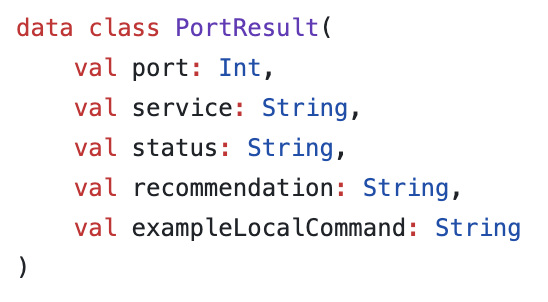
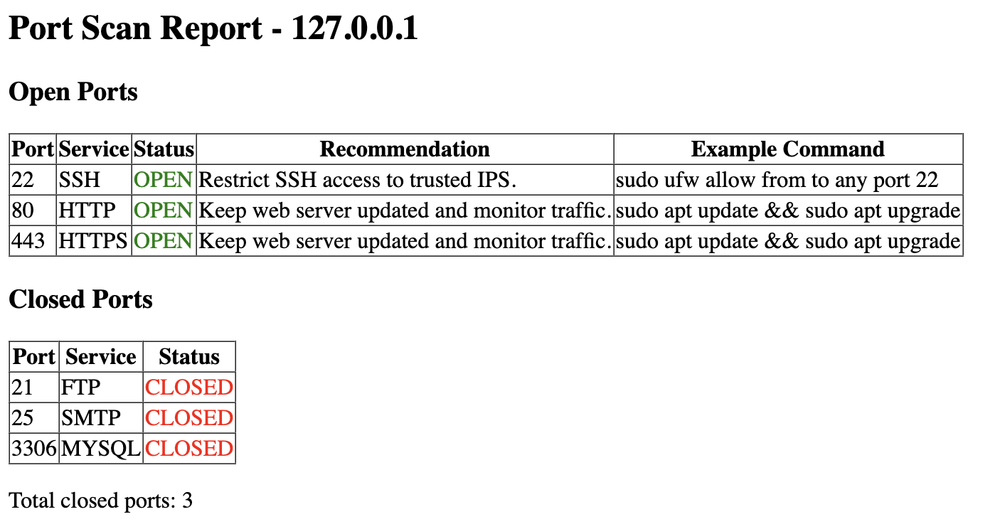

# Kotlin Port Scanner

## Overview
This is a simple port scanner written in Kotlin. It scans common ports on a target IP address (localhost for default) 
and generates an HTML report showing which ports are open and closed, along with service names, security recommendations,
and example commands.

This project demonstrates:
- Kotlin programming and concurrency
- Basic networking with TCP (Transmission Control Protocol) sockets
- Generating HTML reports programmatically
- Safe localhost scanning for demonstration purposes

## Why Kotlin
Kotlin was chosen because: 
- Concise and readable syntax makes network code and threading easier to manage.
- Thread support via kotlin.concurrent.thread, enabling fast concurrent scanning.
- Data classes simplify handling structured scan results.
- Integration with Java libraries ('Socket', 'InetSocketAddress') makes networking straightforward.

In short, Kotlin helps make the port scanner efficient, readable, and easy to extend.

## Ports Chosen
The scanner focuses on common services:
| Port | Service | Purpose |
|------|---------|---------|
| 22   | SSH     | Secure remote access |
| 80   | HTTP    | Web traffic |
| 443  | HTTPS   | Encrypted web traffic |
| 21   | FTP     | File transfer |
| 25   | SMTP    | Sending emails |
| 3306 | MySQL   | Database server |

* SSH = Secure Shell - Allows encrypted remote login to a server or computer. Used for securely managing servers over the network.
* HTTP = HyperText Transfer Protocol - The standard web traffic. Used for unencrypted communication between a browser and a web server. 
* HTTPS = HyperText Transfer Protocol Secure (with Secure Sockets Layer and Transport Layer Security) - Encrypted web traffic. Protects data between a browser and server, preventing eavesdropping.
* FTP = File Transfer Protocol - Allows transferring files between computers over a network. Often replaced by SFTP (SSH File Transfer Protocol) or SCP (Secure Copy Protocol) for security, since plain FTP is unencrypted.
* SMTP = Simple Mail Transfer Protocol - Used to send emails between servers. Important to monitor for spam or abuse.
* MySQL - Database server port (used to access MySQL databases). Should usually be restricted to localhost for security.

These ports were chosen because they are commonly exposed on servers and are relevant for security scanning.

## How It Works
1. The program scans each port on the target IP using a TCP (Transmission Control Protocol) connection.
2. If a connection succeeds within 200ms, the port is marked OPEN; otherwise it is CLOSED.
3. Open ports include security recommendations and example local commands for securing them.
4. The results are split into Open Ports and Closed Ports and saved as PortScanReport.html.

### Technical Details
- Concurrency: Uses kotlin.concurrent.thread to scan multiple ports simultaneously, improving speed.
- Networking: Uses Java's Socket and InetSocketAddress to attempt TCP connections for each port.
- Timeout: 200ms ensures the scanner doesn't hang on closed/unresponsive ports.

## Why TCP?
* TCP is used because it provides a reliable, connection-oriented protocol. Attempting a TCP connection to a port lets us determine if a service is actively listening.

## Demo Mode
You can run the scanner in demo mode to avoid scanning real ports.

val useRealScan = false // Change to true for real scan

* When useRealScan = false, predefined scan results are used.
* When useRealScan = true, the program attempts real TCP connections to the ports.

## Notes / Contributions
- This project is intended for educational/demo use on localhost.
- Scanning external hosts without permission may be illegal.
- Contributions welcome! You could add more ports, support UDP scanning, or improve HTML reporting.

## Data Class & Functions

### 'PortResult' Data Class 
Holds the scan results for each port: 

### scanPort Function
Scans a single port and returns a PortResult:

* Attempts a TCP connection to the target port
* Uses a 200ms timeout
* Returns OPEN or CLOSED
* Provides recommendations and example commands for known services

## How to Run

1. Clone the repository: 

* git clone https://github.com/franciszheng1/KotlinPortScanner.git

* cd kotlin-port-scanner

2. Open the project in IntelliJ IDEA. 
3. Run the main function in PortScanner.kt.
4. Check the generated PortScanReport.html in your project directory.

## Example HTML Report:

## Project Status
✅ Demo version complete and safe for localhost scanning!

⚠️ Real network scanning requires permission from target hosts!

## License
This project is licensed under the MIT License. See LICENSE file for details.

